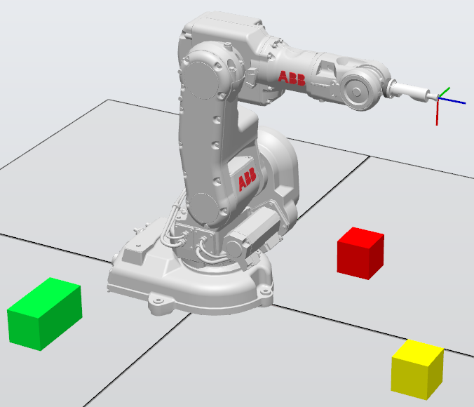
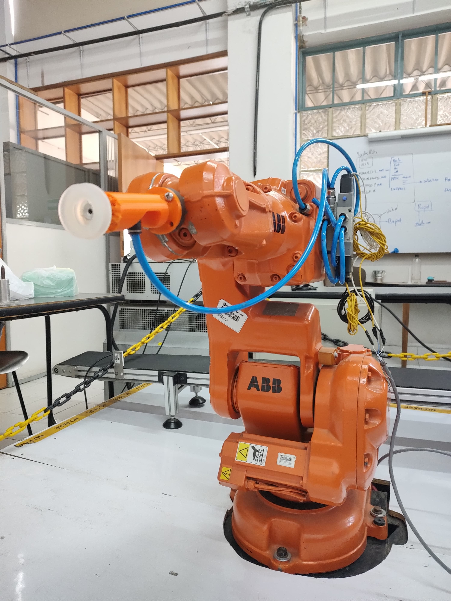
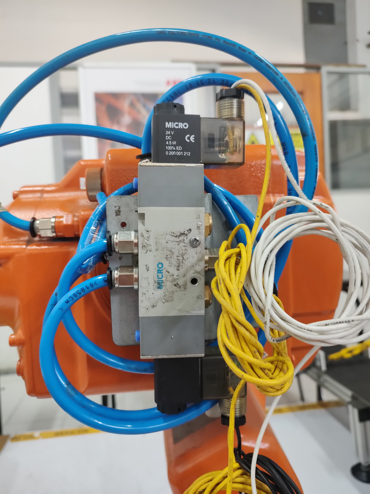
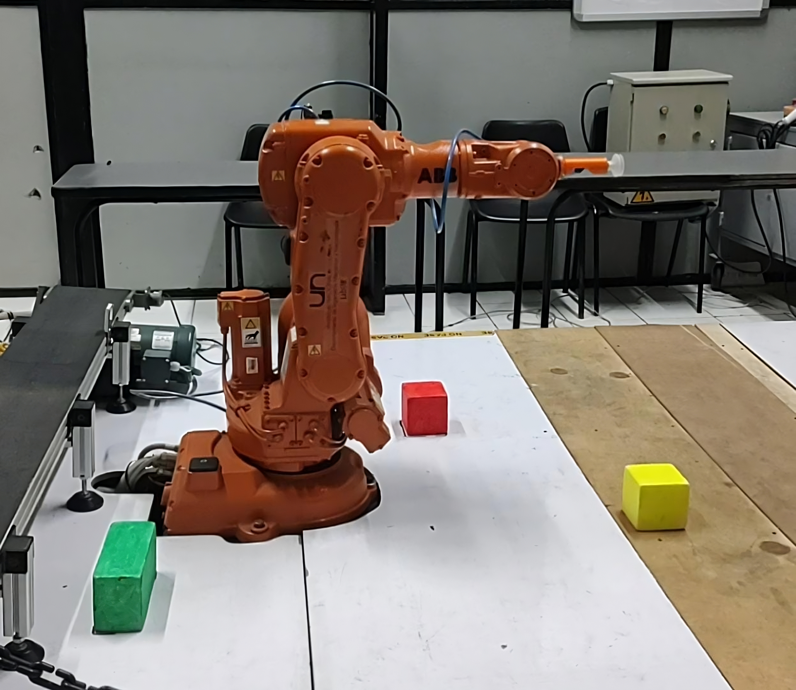
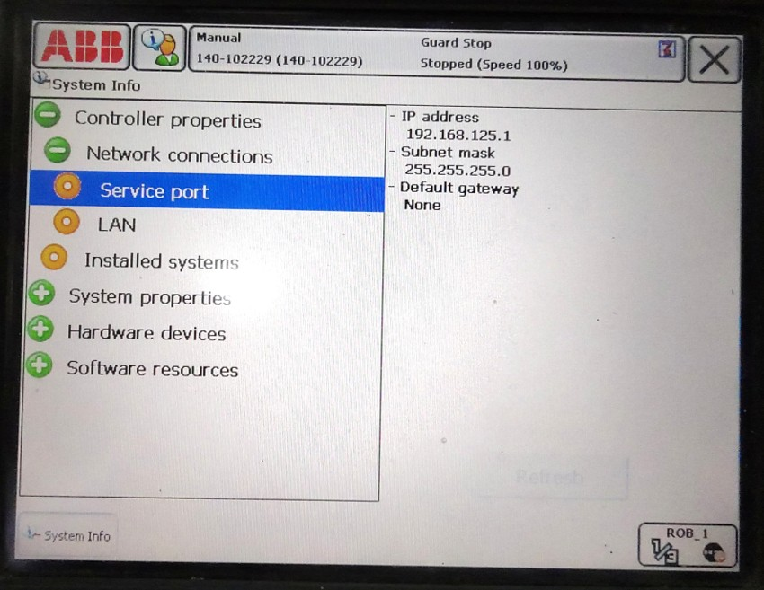

# INFERENCIA DE ORDENES EN LENGUAJE NATURAL A COMANDOS DE ROBOT INDUSTRIAL

**Universidad Nacional de Colombia**
**Facultad de Ingeniería - Departamento de mecánica y mecatrónica**

- **Yovany Esneider Vargas Gutiérrez** *(Ingeniero Mecatrónico)*
- **Pedro Fabián Cárdenas Herrera** *(Profesor, Universidad Nacional de Colombia)*  

---

### Resumen del proyecto

Con el auge de la inteligencia artificial y los **LLM** varias industrias han implementado efectivamente esta tecnología en sus procesos de monitoreo y producción, mejorando en términos de eficiencia y productividad, no siendo la robótica ajena a este fenómeno, se propone la integración de un LLM para la interpretación de órdenes habladas en lenguaje natural a comandos de robot industrial con el fin de reducir considerablemente los tiempos de programación de rutinas de control robótico, partiendo de una respuesta a un prompt inicial, se realiza un mapeo de esta información a comandos compatibles con el controlador del robot en cuestión. En el desarrollo se utiliza Python para la integración de la API de **Groq** donde se ejecuta **Whisper large v3** para el paso de voz a texto plano, el LLM **Llama 3.3 70b versátil**, y el módulo encargado del mapeo a comandos de robot basado en la respuesta del LLM. Partiendo de la contextualización del LLM del rol y tareas a realizar, se ejecuta la simulación con smart components en **Robot Studio 2024**, para su posterior montaje en el robot industrial ABB **IRB 140 6 0.81** ubicado en el LabSir. Con la implementación del sistema, el robot responde correctamente a las órdenes expuestas, limitándose unicamente en los casos en los que el propio controlador del robot determina que el punto a alcanzar es de alto riesgo para el efector final o presenta problemas de singularidad. Estos resultados demuestran la capacidad de esta tecnología en la mejora de la eficiencia y la productividad en la planificación de rutinas de control robótico a nivel industrial.

---

### Objetivos del Proyecto

- Desarrollar un sistema capaz de inferir ordenes en lenguaje natural a comandos de robot industrial
- Seleccionar un LLM que cuente con API de ejecución local
- Seleccionar un modelo de voz a texto que soporte el idioma español
- Crear los módulos que permitan la ejecución y conexión via socket del sistema con el controlador ABB IRC5
- Ejecutar los comandos resultantes en el robot industrial ABB IRB 140 6 0.81

---

### Metodología

El desarrollo del sistema de inferencia de ordenes en lenguaje natural a comandos de robot industrial, consta de cuatro etapas claves.

1. **Investigación**  
  Ecuación de búsqueda en fuentes bibliográficas de indole ingenieril, Wor2Vec y el transformer.

2. **Diseño**  
   2.1 Capacidades del robot  
   2.2 Entorno de operación  
   2.3 Criterios de éxito  
   2.4 Diseño conceptual  

3. **Programación y contextualización del LLM**
4. **Implementación**  
  4.1 Módulos RAPID en controlador IRC5  
  4.2 Montaje en robot real

---

### 1. Investigación

Es necesaria la búsqueda de antecedentes en lo que respecta al procesamiento de lenguaje natural o NLP y su aplicación en robótica, para ello se utiliza la ecuación de búsqueda _("Large Language Model" OR "Natural Language Processing" OR "NLP" OR "LLM") AND ("Robot" OR "Robotic" OR "Robotics" OR "Robotic arm" OR "Robotic manipulator") AND PUBYEAR > 2012 AND PUBYEAR < 2025_, encontrando nueve artículos relevantes para el objetivo del proyecto, se clasifican en tres categorías. Métodos obsoletos, métodos contemporáneos y métodos actuales. Los métodos obsoletos son aquellos que usan procedimientos asociados a la lengua en cuestión, reglas gramaticales y sintácticas, arboles semánticos o campos condicionales aleatorios en cascada para la identificación de elementos en una oración. Estos métodos se quedan atrás frente a la aparición de Word2Vec y su integración a las redes neuronales recurrentes o RNN protagonistas de los métodos contemporáneos, donde resalta un estudio en el cual mediante una red neuronal recurrente y solo 1600 parámetros de entrada se obtiene un desempeño del 73.65% en el procesamiento de lenguaje natural, mucho más eficiente que los métodos anteriores, sin embargo, las redes neuronales recurrentes tienen poca capacidad de memoria, es allí donde aparece el transformer, dicha arquitectura es la protagonista de los métodos actuales, donde se utilizan modelos grandes de lenguaje o por sus siglas en inglés LLM, no obstante, en su mayoría los estudios dejan toda la responsabilidad al LLM de hallar las trayectorias, analizar los obstáculos, entre otros. Esto ocasiona que el desempeño general no supere el 80%, por ello este proyecto ha de utilizar el LLM solo en el NLP para la extracción de las ordenes, seguidamente, python para el mapeo posterior de la respuesta obtenida, a comandos compatibles con el controlador del robot en cuestión, donde este último, dado el caso, es el responsable de la generación de trayectorias.

### 2. Diseño

#### 2.1 Capacidades del robot

Antes de comenzar con la programación y generación de módulos, es esencial identificar las capacidades del robot, el ABB IRB 140 6 0.81 al ser un brazo, cuenta con seis grados de libertad y sus capacidades se limitan a movimiento cartesiano, movimiento articular y el seguimiento de trayectorias predefinidas en su espacio de trabajo, estas trayectorias son números del 0 al 9, que con una modificación sencilla en sus parámetros llegan hasta el 99, otorgándole la capacidad de dibujar números, adicionalmente al girar su sexta articulación y con un objeto sostenido por el efector final, se le atribuye la capacidad de rotar objetos. Dicho efector es una ventosa de vacío, lo que le otorga la capacidad de tomar o soltar objetos, entonces el robot es capaz de llevar a cabo 4 comandos y todas sus combinaciones.

* Tomar y soltar objetos
* Realizar movimientos lineales y articulares
* Rotar objetos
* Dibujar números

#### 2.2 Entorno de operación

Ahora bien en su entorno de trabajo se encuentran 3 objetos identificables por su color y forma, cubo rojo, cubo amarillo y rectángulo verde, todos compuestos de poliestireno expandido, con estos objetos el sistema ha de interactuar, contando con una posición predefinida y que se ha de tener en cuenta en la generación de comandos.

||
|:--:|
|_**Figura 1.** Layout entorno de trabajo._|

#### 2.3 Criterios de éxito

El éxito del proyecto se encuentra en la validación del funcionamiento en totalidad del sistema, es decir, que se ejecuten correctamente los cuatro tipos de comandos y sus combinaciones. Lo que conlleva inevitablemente a someter el sistema al anidado de comandos en una sola entrada.

El desempeño del LLM y el modelo de voz a texto, hace parte de los resultados y no clasifica como criterio de éxito, ya que no hace parte del proyecto enfatizar en el rendimiento de las herramientas utilizadas.

#### 2.4 Diseño conceptual

Partiendo por la arquitectura del sistema, se plantean cuatro etapas entre las ordenes habladas en lenguaje natural y el movimiento del brazo robótico.

||
|:--:|
|_**Figura 2.** Arquitectura del sistema._|

En primera posición el paso de voz a texto mediante un modelo de inteligencia artificial con dicha funcionalidad, el más popular es Whisper de OpenAI el cual es de código abierto, en segunda posición el paso del texto plano como prompt del LLM, siendo este Llama de Meta, también de código abierto. En tercer lugar el modulo de mapeo de la respuesta del LLM a comandos, para su posterior transmisión por protocolo TCP/IP o Socket en ABB, hacia la cuarta y ultima etapa que corresponde al controlador del robot, esta ultima se encarga de la validación de los puntos a alcanzar en pro de cuidar la integridad de la estación.

**Componentes adicionales**

* RobotWare 5.15
* Tubo venturi
* Electroválvula de doble solenoide
* Manguera neumática de 8 mm
* Soporte en impresión 3D para ventosa
* Ventosa común

### 3. Programación y contextualización del LLM

A continuación se mencionan las librerías necesarias para la implementación total del sistema, para visualizar el código al detalle dirigirse a [PythonModules](https://github.com/labsir-un/NLP2Commands_IRB140/tree/main/PythonModules).

Se utiliza Python 3.12.3 con las siguientes librerías:

* _groq_, para usar Whisper y Llama.
* _streamlit_, para desarrollar la interfaz donde se lleva a cabo la contextualización del LLM.
* _keyboard_, para usar teclas en la ejecución del sistema.
* _socket_, para comunicar Python con el controlador del robot.
* _numpy_, para manipular listas.
* _scipy_, para transformar ángulos de euler a quaternios.
* _ast_, para convertir strings a listas.
* _tempfile_, para usar archivos temporales.
* _pyaudio_, para capturar audio,
* _wave_, para manipular archivos _.wav_.
* _os_, para abrir archivos.

La contextualización consta de otorgarle al LLM el rol de un robot con la capacidad de transformar ordenes en lenguaje natural a acciones, objetivos y valores. Seguidamente se exponen ejemplos de las acciones que puede reconocer y la relación entre ellas con los objetos del entorno, de igual manera se le otorgan indicaciones de signos, de acuerdo a la estación y la sexta articulación. Siendo derecha Y-, adelante X+ y arriba Z+. Cuando se le dice que gire y no se especifica la dirección debe ser positivo. Por ejemplo, `gira 45 grados el Objeto A` la salida debe ser 45, ya que no se le ha especificado la dirección de giro. En cada prompt se le solicita un feedback de lo ya explicado, para garantizar la presencia de toda la información en cada respuesta.

| Orden  | Respuesta|
|:------:|:----------:|
| Toma el cubo amarillo | Pick, Cubo amarillo, 1 |
| Suelta el cubo rojo | Pick, Cubo rojo, 0 |
| Mueve el cubo rojo 10 centímetros a la derecha    |  Move, Cubo rojo, -10Y    |
| Lleva el rectángulo verde a la posición 0, 0, 120 | Move, Rectángulo verde, [0,0,120] |
| Rota el cubo amarillo media vuelta | Rotate, Cubo amarillo, 180 |
| Dibuja la resta de 70 menos 43 | Draw, none, 27 |

Para observar al detalle todos los prompts de contextualización, ejecutar el archivo [contextingLLM.py](https://github.com/labsir-un/NLP2Commands_IRB140/tree/main/PythonModules/contextingLLM.py), con el comando _`streamlit run contextingLLM.py`_ en consola.

### 4. Implementación

#### 4.1 Módulos RAPID en controlador IRC5

Para una correcta distribución del programa en el controlador del robot, se desarrolla en tres módulos.

**_Parameters_**

Acá se definen todos los parámetros asociados a la estación, distancias de seguridad, objetos de trabajo, herramientas, entre otros.

```c
...
! Safety parameters
CONST num safeZ := 150;
CONST num heightObjects := 100;
! For real environment the offsetHeightPick is 5
CONST num offsetHeightPick := 0;
CONST num safeHeightPick := offsetHeightPick - heightObjects;
! Controller parameters
CONST num lengthStrings {9} := [4, 4, 4, 12, 12, 12, 12, 1, 4];
CONST num tensOffset := 70;
CONST speeddata generalSpeed := v80;
CONST zonedata generalZone := z10;
CONST zonedata pickZone := fine;
CONST jointtarget homeJoints := [[0, 0, 0, 0, 0, 0],[0, 0, 0, 0, 0, 0]];
PERS tooldata vacuumGripper := [TRUE, [[0, 0, 129.78],[1, 0, 0, 0]],[1, [0, 0, 1],[1, 0, 0, 0], 0, 0, 0]];
PERS wobjdata drawBoard := [FALSE,TRUE,"",[[350,-300,450],[0,0,1,0]],[[0,0,0],[1,0,0,0]]];
...
```

**_Numbers_**

Este módulo almacena todos los puntos para la generación de números, además de 3 arreglos auxiliares para el correcto recorrido de los puntos mediante un ciclo for.

```c
CONST robtarget numbersPoints{133} := [P_01, ...
                                        ...
                                        P_91, ...];
CONST num amountPoints{10} := [8, 5, 10, 19, 5, 14, 20, 2, 20, 20]; ! Amount of points per number
CONST num startIndices{10} := [1, 10, 16, 27, 47, 53, 68, 89, 92, 113];
```

**_MainModule_**

Este modulo contiene todos los procedimientos y funciones vinculados al proyecto, donde el procedimiento más relevante es `GetCommand`. Este recibe los datos provenientes del cliente, genera un punto objetivo con esos datos y ejecuta el comando entrante.

```c
PROC GetCommand()
    VAR string clientData;
    SocketReceive clientSocket \str := clientData \Time:= WAIT_MAX; ! Data from client
    String2CommandParameters(clientData); ! String data to numbers
    goalPoint := [[x, y, z],[qw, q1, q2, q3],[0, 0, 0, 0],[9E9, 9E9, 9E9, 9E9, 9E9, 9E9]]; ! Create goalPoint robTarget
    IF command = 0 THEN ! Pick
        PickCommand;
    ELSEIF command = 1 THEN ! Move
        MoveCommand;
    ELSEIF command = 2 THEN ! Rotate
        RotateCommand;
    ELSEIF command = 3 THEN ! Draw
        DrawCommand;
    ENDIF
    WaitTime(2); ! Before the next command
ENDPROC
```
En los comandos move y pick se realiza una validación del punto a alcanzar, para ello se establece un valor seguro para Z, si es inferior, el controlador no ejecuta dicho comando. Con al función `NotReachable`, se valida la configuración articular a alcanzar para un punto en especifico, de manera que de no ser posible dicha configuración, tampoco se ejecuta el comando.

```c
FUNC bool NotReachable(robtarget pointToReach, PERS tooldata tool, PERS wobjdata workObject)
    VAR jointtarget jointsCalculation;
    VAR bool notReachable := FALSE;
    jointsCalculation := CalcJointT(pointToReach, tool \Wobj := workObject);
    RETURN notReachable;
    ERROR
    IF ERRNO = ERR_ROBLIMIT OR ERRNO = ERR_OUTSIDE_REACH THEN
        notReachable := TRUE;
        TRYNEXT;
    ENDIF
ENDFUNC
```

#### 4.2 Montaje en robot real

Para el montaje en el robot real, se utilizaron herramientas como destornillador, pinzas, cinta de enmascarar y marcador permanente. A continuación un paso a paso del procedimiento.

1. **Montaje del efector final**

Para fijar el soporte se utilizan 2 tornillos M6 de 10   mm de longitud, de manera que la apertura lateral se oriente hacia abajo. Como se observa en la _Figura 3_.

||
|:--:|
|_**Figura 3.** Robot con efector final._|

Seguidamente se ajusta la electro válvula al lateral izquierdo de la carcasa del brazo superior, esto involucra un soporte adicional, el cual se sostiene con dos tornillos M5 de 4 cm de longitud. Al soporte se atornilla la electro válvula con un tornillo de las mismas características. Como se observa en la _Figura 4_.

||
|:--:|
|_**Figura 4.** Montaje electro válvula._|

La electro válvula tiene como entrada el suministro de aire a traves del brazo, la primera salida alimenta el tuvo venturi, ubicado entre el soporte y la carcasa. La abertura lateral del tuvo venturi se conecta a la ventosa, de manera que la presión positiva generada en dicha abertura, genera el vacío necesario para levantar los objetos. La segunda salida corresponde a una manguera bloqueada, de manera que la válvula pueda alternar correctamente entre salidas. La configuración I/O del controlador es la siguiente.

| Salida controlador | Electroválvula |
|:--:|:--:|
| DO_1 | Light_1 |
| DO_2 | Light_2 |
| DO_3 | IN_24V_1 |
| DO_4 | IN_24V_2 |
| GND | GND_1 & GND_2 |

De manera que, para encender la ventosa, se activa *DO_3* y se desactiva *DO_4*, y su opuesto en caso contrario.

2. **Preparación del entorno**

Las posiciones predefinidas de los tres objetos son las siguientes.

| Objeto | Posición (X, Y) [mm]|
|:--:|:--:|
| Cubo rojo | (300, 300)|
| Cubo amarillo | (700, -200) |
| Rectángulo verde | (-300, -400) |

Se identifican estos puntos como el centro de cada objeto y se ubican en la estación de trabajo, señalando con marcador la posición de los mismos. Como se observa en la _Figura 5_.

||
|:--:|
|_**Figura 5.** Estación real._|

3. **Conexión al sistema**

La conexión se realiza a través del puerto de servicio del controlador del robot, por tanto es necesario hallar a dirección IP del mismo. Para ello, se accede mediante el TeachPendant a `System Info/Controller properties/Network connections/Service port` y en la ventana lateral derecha se observa la dirección IP y su máscara, como se observa en la _Figura 6_.

||
|:--:|
|_**Figura 6.** TeachPendant, puerto de servicio._|

Esta dirección IP se utiliza en la linea 38 de la función `main` en el archivo [main.py](https://github.com/labsir-un/NLP2Commands_IRB140/tree/main/PythonModules/main.py), para la conexión cliente servidor via TCP/IP o socket en ABB.

### 5. Resultados

Tanto en simulación como en el robot real no se entra en detalle en el desempeño de _Whisper Large V3_ ya que este depende meramente del habla, ruido y sonido ambiental. Siendo que cuando se habla fuerte y claro, este no presenta errores de ningún tipo.

#### 5.1 Resultados en simulación

[](https://www.youtube.com/watch?v=G_UeWlkgMdY)

_**Video 1.** Resultados en simulación, RobotStudio 2024._

En simulación se cumplen con todos los criterios de éxito, no obstante, hace presencia una mala interpretación por parte del LLM en la identificación del objetivo en un comando de movimiento, al ser una herramienta complemento del sistema, el desempeño del LLM puede ser mejorado e incluso ser remplazado por uno mejor como DeepSeek R1, sin comprometer el funcionamiento del sistema. Teniendo en cuenta este error, el desempeño del sistema es del 88.8 % para ordenes con 9 comandos anidados.

#### 5.2 Resultados en entorno real

[](https://www.youtube.com/watch?v=Xe3ISFExZHU)

_**Video 2.** Resultados en robot real, LabSir._

En el robot real, se ejecuta el sistema satisfactoriamente, no obstante y de igual manera que en simulación, hace presencia una mala interpretación por parte del LLM en la dirección de giro en comando de giro. Teniendo en cuenta este error, el desempeño del sistema es del 91.7 % para ordenes con 12 comandos anidados.

### 6. Conclusiones

* La inteligencia artificial es la herramienta ideal para el desarrollo de sistemas más eficientes, siendo que el hecho de ubicar un objeto en un punto del espacio con solo una orden en lenguaje natural, corresponde a hacer un Pick & Place en segundos.

* A diferencia de investigaciones pasadas, el sistema de _Inferencia de ordenes en lenguaje natural a comandos de robot industrial_, presenta migración a otros idiomas sin inconvenientes, esto por la naturaleza de los LLMs y su trazabilidad de conceptos.

* Aunque los LLMs superan en capacidad de atención a las RNNs, en entradas con un numero elevado de tokens, los mecanismos de atención dejan de converger eficientemente cuando el concepto requerido se ha dejado de lado, esto se evidencia en la dirección en el giro errónea y el olvido de soltar los objetos ya tomados.

---

### Bibliografía

[1] Tomas Mikolov, Ilya Sutskever, Kai Chen, Greg Corrado, and Jeffrey Dean. Distributed representa-
tions of words and phrases and their compositionality. 10 2013. URL http://arxiv.org/abs/1310.4546.

[2] Ashish Vaswani, Noam Shazeer, Niki Parmar, Jakob Uszkoreit, Llion Jones, Aidan N. Gomez, Lukasz
Kaiser, and Illia Polosukhin. Attention is all you need. 6 2017. URL http://arxiv.org/abs/
1706.03762.
[3] Yilmaz Kilicaslan and Gurkan Tuna. An nlp-based approach for improving human-robot interac-
tion. Journal of Artificial Intelligence and Soft Computing Research, 3:189–200, 7 2013. ISSN 2083-
2567. doi: 10.2478/jaiscr-2014-0013. URL https://www.sciendo.com/article/10.2478/
jaiscr-2014-0013.
[4] Weiwei Li, Kun Xu, Jing Qi, and Xilun Ding. A natural language processing method of chinese
instruction for multi-legged manipulating robot. In 2018 IEEE International Conference on Robotics
and Biomimetics (ROBIO), pages 2171–2176. IEEE, 12 2018. ISBN 978-1-7281-0377-8. doi: 10.
1109/ROBIO.2018.8664888. URL https://ieeexplore.ieee.org/document/8664888/.
[5] Kadir Aram, Gokhan Erdemir, and Burhanettin Can. Formation control of multiple autonomous mo-
bile robots using turkish natural language processing. Applied Sciences, 14:3722, 4 2024. ISSN 2076-
3417. doi: 10.3390/app14093722. URL https://www.mdpi.com/2076-3417/14/9/3722.
[6] Hao Li, Yu-Ping Wang, and Tai-Jiang Mu. Nerva: Automated application synthesis for humanoid
robot from user natural language description. Communications in Information and Systems, 17:45–
64, 2017. ISSN 15267555. doi: 10.4310/CIS.2017.v17.n1.a3. URL https://link.intlpress.
com/JDetail/1805790732743032834.
[7] Wittawin Kahuttanaseth, Alexander Dressler, and Chayakorn Netramai. Commanding mobile robot
movement based on natural language processing with rnn encoderdecoder. In 2018 5th International
Conference on Business and Industrial Research (ICBIR), pages 161–166. IEEE, 5 2018. ISBN 978-
1-5386-5254-1. doi: 10.1109/ICBIR.2018.8391185. URL https://ieeexplore.ieee.org/
document/8391185/.
[8] Beili Dong, Junhong Chen, Zeyu Wang, Kaizhong Deng, Yiping Li, Benny Lo, and George Mylonas.
An intelligent robotic endoscope control system based on fusing natural language processing and
vision models. In 2024 IEEE International Conference on Robotics and Automation (ICRA), pages
8180–8186. IEEE, 5 2024. ISBN 979-8-3503-8457-4. doi: 10.1109/ICRA57147.2024.10611534.
URL https://ieeexplore.ieee.org/document/10611534/.
[9] Guang Li, Xinzhe Han, Pengcheng Zhao, Pengju Hu, Lu Nie, and Xiaoning Zhao. Robochat: A unified
llm-based interactive framework for robotic systems. In 2023 5th International Conference on Robo-
tics, Intelligent Control and Artificial Intelligence (RICAI), pages 466–471. IEEE, 12 2023. ISBN 979-
8-3503-5795-0. doi: 10.1109/RICAI60863.2023.10489289. URL https://ieeexplore.ieee.
org/document/10489289/.
[10] Kangtong Mo, Wenyan Liu, Fangzhou Shen, Xuanzhen Xu, Letian Xu, Xiran Su, and Ye Zhang. Preci-
sion kinematic path optimization for high-dof robotic manipulators utilizing advanced natural lan-
guage processing models. In 2024 5th International Conference on Electronic Communication and Ar-
tificial Intelligence (ICECAI), pages 649–654. IEEE, 5 2024. ISBN 979-8-3503-8694-3. doi: 10.1109/
ICECAI62591.2024.10675146. URL https://ieeexplore.ieee.org/document/10675146/.