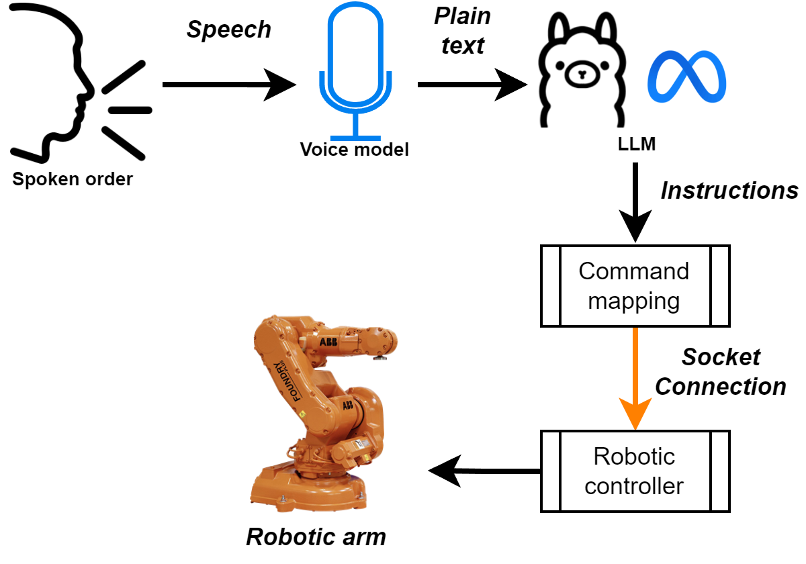

# INFERENCIA DE ORDENES EN LENGUAJE NATURAL A COMANDOS DE ROBOT INDUSTRIAL

**Universidad Nacional de Colombia**
**Facultad de Ingeniería - Departamento de mecánica y mecatrónica**

- **Yovany Esneider Vargas Gutiérrez** *(Ingeniero Mecatrónico)*
- **Pedro Fabián Cárdenas Herrera** *(Profesor, Universidad Nacional de Colombia)*  

---

### Resumen del proyecto

Con el auge de la inteligencia artificial y los **LLM** varias industrias han implementado efectivamente esta tecnología en sus procesos de monitoreo y producción, mejorando en términos de eficiencia y productividad, no siendo la robótica ajena a este fenómeno, se propone la integración de un LLM para la interpretación de órdenes habladas en lenguaje natural a comandos de robot industrial con el fin de reducir considerablemente los tiempos de programación de rutinas de control robótico, partiendo de una respuesta a un prompt inicial, se realiza un mapeo de esta información a comandos compatibles con el controlador del robot en cuestión. En el desarrollo se utiliza Python para la integración de la API de **Groq** donde se ejecuta **Whisper large v3** para el paso de voz a texto plano, y el LLM **Llama 3.3 70b versátil**, adicionalmente el modulo encargado del mapeo a comandos de robot, basado en la respuesta del LLM. Partiendo de la contextualización del LLM al rol y tareas a realizar, seguidamente la simulación con smart components en **Robot Studio 2024** y  en posterior validación de resultados en el LabSir con el robot industrial ABB **IRB 140 6 0.81**. Con la implementación del sistema, el robot responde correctamente a las órdenes expuestas, limitándose unicamente en los casos en los que el propio controlador del robot determina que el punto a alcanzar es de alto riesgo para el efector final o presenta problemas de singularidad. Estos resultados demuestran la capacidad de esta tecnología en la mejora de la eficiencia y la productividad en la planificación de rutinas de control robótico a nivel industrial.

---

### Objetivos del Proyecto

- Desarrollar un sistema capaz de inferir ordenes en lenguaje natural a comandos de robot industrial
- Seleccionar un LLM que cuente con API de ejecución local
- Seleccionar un modelo de voz a texto que soporte el idioma español
- Crear los módulos que permitan la ejecución y conexión via socket del sistema con el controlador IRC5
- Ejecutar los comandos resultantes en el robot industrial IRB 140 6 0.81

---

### Metodología

El desarrollo del sistema de inferencia de ordenes en lenguaje natural a comandos de robot industrial, consta de cuatro etapas claves.

1. **Investigación**  
  Ecuación de búsqueda en fuentes bibliográficas de indole ingenieril, Wor2Vec y el transformer.

2. **Diseño**  
   2.1 Capacidades del robot
   2.2 Entorno de operación
   2.3 Criterios de éxito
   2.4 Diseño conceptual

3. **Programación y contextualización del LLM**
4. **Implementación**  
  4.1 Módulos RAPID en controlador IRC5
  4.2 Smart components en la simulación de estación
  4.3 Montaje en robot real

---

### 1. Investigación

Es necesaria una búsqueda de antecedentes en lo que respecta al procesamiento de lenguaje natural o NLP y su aplicación en robótica, para ello se utiliza la ecuación de búsqueda _("Large Language Model" OR "Natural Language Processing" OR "NLP" OR "LLM") AND ("Robot" OR "Robotic" "Robotics" OR "Robotic arm" OR "Robotic manipulator") AND PUBYEAR > 2012 AND PUBYEAR < 2025_, encontrando nueve artículos relevantes para el objetivo del proyecto, se clasifican en tres categorías. Métodos obsoletos, métodos contemporáneos y métodos actuales. Los métodos obsoletos son aquellos que usan procedimientos asociados a la lengua en cuestión, reglas gramaticales y sintácticas, arboles semánticos o campos condicionales aleatorios en cascada para la identificación de elementos en una oración. Dichos métodos quedan obsoletos frente a la aparición de Word2Vec y su integración a las redes neuronales recurrentes, allí es donde están los métodos contemporáneos, donde resalta un estudio el cual mediante una red neuronal recurrente y 1600 parámetros de entrada, obtiene un desempeño del 73.65% en el procesamiento de lenguaje natural, mucho más eficiente que los métodos anteriores, sin embargo, las redes neuronales recurrentes tiene poca capacidad de memoria, es allí donde aparece el transformer, dicha arquitectura es la protagonista de los métodos actuales, donde se utilizan modelos grandes de lenguaje o por sus siglas en inglés LLM, no obstante, en su mayoría los estudios dejan toda la responsabilidad al LLM de hallar las trayectorias, analizar los obstáculos, entre otros. Esto ocasiona que el desempeño general no supere el 80%, por ello este proyecto ha de utilizar el LLM solo en el NLP para la extracción de las ordenes, seguidamente, python para el mapeo posterior de la respuesta obtenida a comandos compatibles con el controlador del robot en cuestión, donde este último es el responsable de la generación de trayectorias, dado el caso.

### 2. Diseño

#### 2.1 Capacidades del robot

Antes de comenzar con la programación y generación de módulos, es esencial identificar las capacidades del robot, el ABB IRB 140 6 0.81 al ser un brazo, cuenta con seis grados de libertad y sus capacidades se limitan a movimiento cartesiano, movimiento articular y el seguimiento de trayectorias predefinidas en su espacio de trabajo, estas trayectorias son números del 0 al 9, que con una modificación sencilla en sus parámetros llegan hasta el 99, otorgándole la capacidad de dibujar números, adicionalmente al girar su sexta articulación y con un objeto sostenido por el efector final, se le atribuye la capacidad de rotar objetos. Dicho efector es una ventosa de vacío, lo que le otorga la capacidad de tomar o soltar objetos, entonces el robot es capaz de llevar a cabo 4 comandos y todas sus combinaciones.

* Tomar y soltar objetos
* Realizar movimientos lineales y articulares
* Rotar objetos
* Dibujar números

#### 2.2 Entorno de operación

Ahora bien en su entorno de trabajo se encuentran 3 objetos identificables por su color y forma, cubo rojo, cubo amarillo y rectángulo verde, todos compuestos de poliestireno expandido, con estos objetos el sistema ha de interactuar, contando con una posición predefinida y que se ha de tener en cuenta en la generación de comandos.

||
|:--:|
|_**Figura 1.** Layout entorno de trabajo._|

#### 2.3 Criterios de éxito

El éxito del proyecto se encuentra en la validación del funcionamiento en totalidad del sistema, es decir, que se ejecuten correctamente los cuatro tipos de comandos y sus combinaciones. Lo que conlleva inevitablemente a someter el sistema al anidado de comandos en una sola entrada.

El desempeño del LLM y el modelo de voz a texto, hace parte de los resultados y no clasifica como criterio de éxito, ya que no hace parte del proyecto enfatizar en el rendimiento de las herramientas utilizadas.

#### 2.4 Diseño conceptual

Partiendo por la arquitectura del sistema, se plantean cuatro etapas entre las ordenes habladas en lenguaje natural y el movimiento del brazo robótico.

||
|:--:|
|_**Figura 2.** Arquitectura del sistema._|

En primera posición el paso de voz a texto mediante un modelo de inteligencia artificial con dicha funcionalidad, el más popular es Whisper de OpenAI el cual es de código abierto, en segunda posición el paso del texto plano como prompt del LLM, siendo este Llama de Meta, también de código abierto. En tercer lugar el modulo de mapeo de la respuesta del LLM a comandos, para su posterior transmisión por protocolo TCP/IP o Socket en ABB, hacia la cuarta y ultima etapa que corresponde al controlador del robot, esta ultima se encarga de la validación de los puntos a alcanzar en pro de cuidar la integridad de la estación.

**Componentes adicionales**

* RobotWare 5.15
* Tubo venturi
* Electroválvula de doble solenoide
* Manguera neumática de 8 mm
* Soporte en impresión 3D para ventosa
* Ventosa común

### 3. Programación y contextualización del LLM

A continuación se mencionan las librerías necesarias para la implementación total del sistema, para visualizar el código en detalle dirigirse a la carpeta [PythonModules](https://github.com/labsir-un/NLP2Commands_IRB140/tree/main/PythonModules).

Se utiliza Python 3.12.3 con las siguientes librerías:

* _groq_, para usar Whisper y Llama.
* _streamlit_, para desarrollar la interfaz donde se lleva a cabo la contextualización del LLM.
* _keyboard_, para usar teclas en la ejecución del sistema.
* _socket_, para comunicar Python con el controlador del robot.
* _numpy_, para manipular listas.
* _scipy_, para transformar ángulos de euler a quaternios.
* _ast_, para convertir strings a listas.
* _tempfile_, para usar archivos temporales.
* _pyaudio_, para captar audio,
* _wave_, para manipular archivos _.wav_.
* _os_, para abrir archivos.

### 4. Implementación

#### 4.1 Módulos RAPID en controlador IRC5

### 5. Resultados
#### 4.1 Resultados en simulación

#### 4.2 Resultados en entorno real

